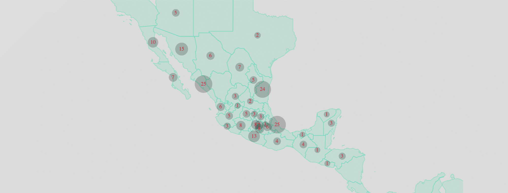

  <h2 class="page-subtitle">Análisis crítico • Memoria colectiva</h2>
  

    <h1>Saberes para  la búsqueda de  personas desaparecidas en México.</h1>
    
+100,000 personas han sido desaparecidas en México. La inacción y omisión de las autoridades, el estancamiento burocrático y la impunidad han llevado a las familias a tomar el asunto en sus propias manos para emprender la búsqueda de sus seres queridos. ↓

  

<h3>Herramientas</h3>

  

  
  
  

  

  

  
Familiares de personas desaparecidas comparten sus saberes prácticos: métodos y herramientas para la búsqueda e identificación de personas, cómo recolectar y documentar información, cómo gestionar la relación con autoridades, cómo resguardar la seguridad, cultivar el cuidado emocional, el sentido de comunidad y el actuar en colectivo. Una guía de resiliencia y transformación personal.

  <a href="{{ '/tools/' | absolute_url }}" style="margin-left:18px;">Leer más</a>
  

<!-- row -->

<!-- content-container -->

  <h4>"
  Desde el momento que yo decidí salir a las calles a buscar a mi hijo, fue a denunciar, a visibilizar por todos lados y no me he quedado callada. Es alzar la voz, gritar por todos lados, que escuchen, que se sepa lo que está pasando con las personas migrantes.
  "
  </h4>
  <h5>– Ana Enamorado, Honduras.</h5>

<!-- quote content-container -->

<h3>Testimonios</h3>

  

    

  

  

    
60 entrevistas con madres, abuelas, tías, hermanas, esposas, hijas, padres, hermanos e hijos que buscan a sus seres queridos desaparecidos en México. Una compilación personal sobre el antes y el después de la desaparición, el significado de la búsqueda y la transformación del miedo en fuerza y esperanza para encontrarles.

    <a href="{{ '/testimonios/' | absolute_url }}" style="margin-left:18px;">Leer más</a>
  

  <h4 class="light">"
  En la medida en que logremos concientizar a más población habrá más empatía y tendremos mejores estrategias, no solo de manera personal, sino también colectivas, para cuidarnos, para auto-protegernos. Vamos politizándonos, eso nos da una conciencia más madura, una conciencia política que nos ayuda a pensar."
  </h4>
  <h5 class="dark">– Laura María Orozco.</h5>

<!-- quote content-container -->

  

    <h3>Documentos</h3>
    
Una compilación de herramientas bibliográficas y documentos para la búsqueda y voces de la búsqueda; leyes, protocolos gubernamentales, guías básicas, testimonios e historias de búsqueda realizadas por organizaciones de sociedad civil y organismos internacionales de la mano de los familiares.

    <a href="{{ '/documentos/' | absolute_url }}" class="bottom">Consultar</a>
  

  

    <h3>Bibliografía</h3>
    
Una selección de literatura, trabajo periodístico, análisis académico, poesía, películas, proyectos multimedia, que funciona como introducción al contexto en México, la desaparición y la búsqueda.
 
    <a href="{{ '/recursos/' | absolute_url }}" class="bottom">Consultar</a>
  

  <h3>Mapas</h3>
  
Visualizaciones que reflejan el actuar colectivo ante la desaparición y el surgimiento del trabajo de búsqueda en México y en países a su alrededor. Un análisis de datos y narrativa con la percepción de organización colectiva y de violencia.

  

    
  

  <a href="{{ '/datavis/' | absolute_url }}">Ver Mapas</a>

  <h3>Directorio</h3>
  
Una base de datos con la información de contacto de colectivos, organizaciones de sociedad civil, organismos internacionales e instituciones de gobierno, para facilitar la conexión, comunicación y acceso a la información.

  <a href="{{ '/directorio/' | absolute_url }}">Consultar</a>

 <!-- class="content-container" -->

