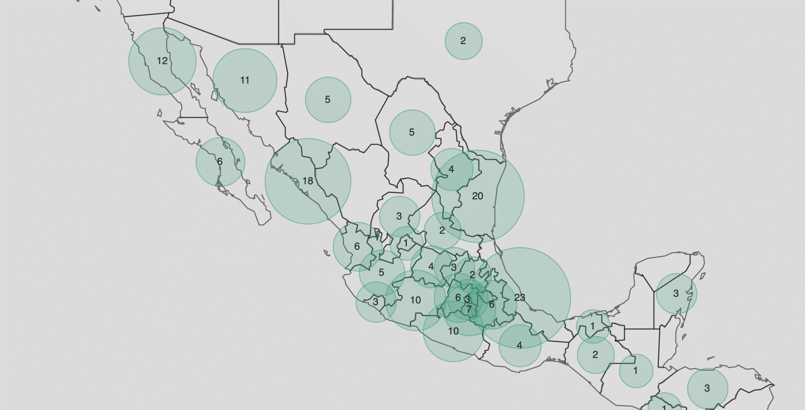

  <h2 class="page-subtitle">{{ site.title }}</h2>
  

    <h1>Saberes para  la búsqueda de  personas desaparecidas en México.</h1>
    
Los colectivos de buscadoras han desarrollado métodos de búsqueda, redes de soporte psico-social y protocolos para navegar las instituciones.

    
Estas son sus historias ↓

  

<h3>Herramientas</h3>

  
  
  
<!---->

  

  

  
Familiares comparten sus saberes: métodos y herramientas para la búsqueda e identificación de personas, cómo recolectar y documentar información, cómo gestionar la relación con autoridades, cómo resguardar la seguridad, el cuidado emocional, el sentido de comunidad y el actuar en colectivo, una guía de resiliencia y transformación personal.

  <a href="{{ '/tools/' | absolute_url }}">Leer más</a>
  

<!-- row -->

<!-- content-container -->

  <h4>" Esto es una montaña rusa de sentimientos.
  A veces estamos tristes, a veces fuertes, sentimos impotencia.
  Exigimos a las autoridades tradicionales que hablen, que no tengan miedo.
  A veces estamos muy felices, nos abrazamos, lloramos, pero estamos juntos, nos acompañamos "</h4>

<h3>Testimonios</h3>

  

    

  

  

    
Relatos de vida de Buscadoras de México y Estados Unidos.

  <a href="{{ '/testimonios/' | absolute_url }}">Leer más</a>
  

  

    <h3>Documentos</h3>
    
Materiales fundamentales para la desaparición y la búsqueda; leyes, protocolos, guías y testimonios.

    <a href="{{ '/documentos/' | absolute_url }}" class="bottom">Consultar</a>
  

  

    <h3>Recursos</h3>
    
Bibliografía sobre el contexto de violencia en México, producida por investigadores, periodistas, colectivos y activistas.
 
    <a href="{{ '/recursos/' | absolute_url }}" class="bottom">Consultar</a>
  

  <h3>Mapas & Visualizaciones</h3>
  
En esta sección encontrarás un mapa con los colectivos existentes en México por estado, con su información de contacto. Además trabajamos en mostrar una mirada más profunda a variables de percepción de violencia en México, organización comunitaria, violencia por municipio de 2015 a 2021.

  

    
  

  <a href="{{ '/datavis/' | absolute_url }}">Ver Mapas</a>

  <h3>Directorio</h3>
  
Contactos de colectivos, organizaciones de la sociedad civil, instituciones, grupos solidarios, de soporte legal y activistas.

  <a href="{{ '/directorio/' | absolute_url }}">Leer más</a>

 <!-- class="content-container" -->

<h3>Tesoros</h3>

  
  
  
<!---->

  

  
  
  
<!---->

  

  
  
  
<!---->

  

<!-- row -->

 
<a href="{{ '/tesoros/' | absolute_url }}">Fichas de personas desaparecidas</a>

<!-- content-container -->

